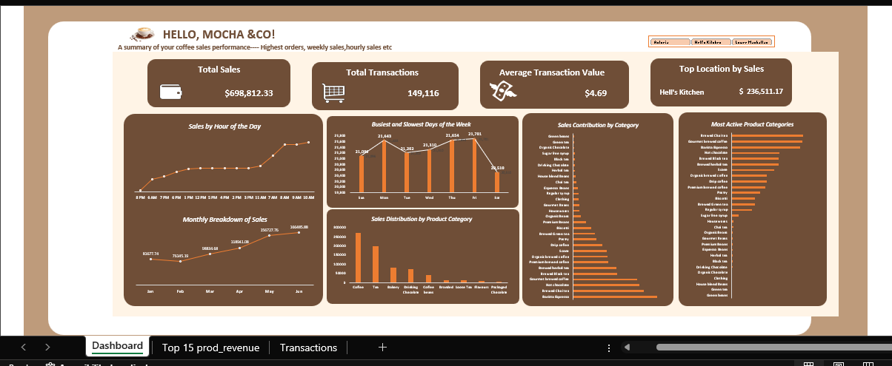

# Coffee-Sales

### Project Overview
Analyze coffee sales performance across products, locations, and time periods.
This dashboard highlights top-selling items, peak sales hours, and revenue trends to support data-driven business decisions.

### Data Sources.
The analysis is based on the “Coffee Sales Data (Excel)” file, which contains detailed records of daily transactions across different products, stores, and time periods. 
It includes information such as ;
+ Product names
+ Quantity sold
+ Sales amount
+ Store Location and transaction dates, providing a clear view of sales performance and customer purchasing trends.

### Tools Used
- Power Query - Data Cleaning and transformation
- Excel - Pivot table and calculated metric
- Revenue aggregation
- Time-based trend analysis (daily / hourly patterns)
- Product performance comparison

## Dashboard Preview

**KEY QUESTIONS TO ADDRESS**
+ Which coffee products generate the highest revenue?
+ What are the peak sales hours and busiest days?
+ Which store locations perform best?
+ Are there seasonal or daily sales trends?
+ Which products underperform and may require strategic adjustment?

## Key Insights
+ The top 3 products contributed X% of total revenue, indicating revenue concentration.
+ Peak sales occurred between 9:00AM-10:00AM, suggesting optimal staffing periods.
+ Weekend sales increased by X% compared to weekdays.
+ One location consistently outperformed others by X% in total revenue.
